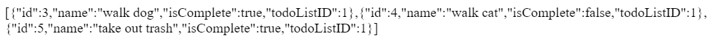
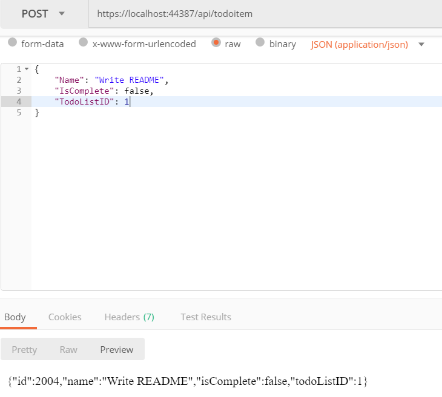
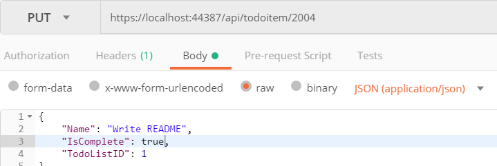
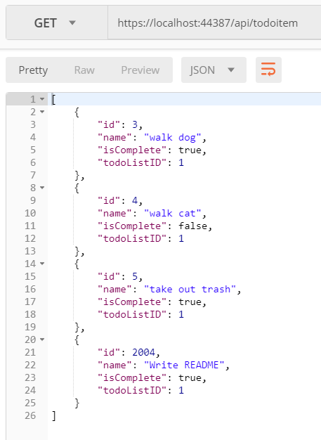
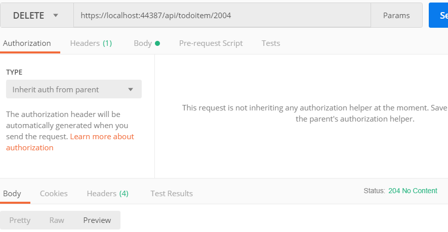
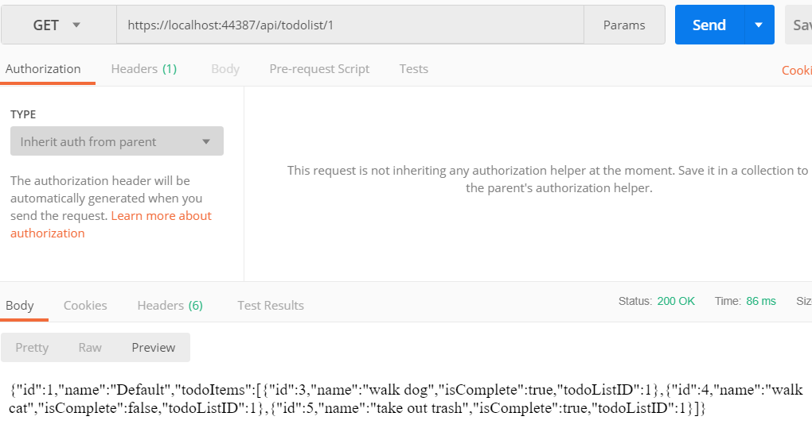

# Lab17CreateAnAPI

## Summary
This is an api which stores data on several todo tasks and lists of todo tasks.  
This current repository only holds the api data, to access it follow the directions below.  

## Visuals
Here are some visuals of the api in action using [Postman](https://www.getpostman.com/):  
Getting all tasks:  
  
Creating a new task:  
  
Updating a task:  
  
How all the tasks look like currently:  
  
Deleting a task:  
  
Getting a Todo List:  
  

## Directions
To use the api:  
1. Download [Postman](https://www.getpostman.com/)  
2. a. If you want to access the list of todo tasks, put __________ into the request url.  
2. b. If you want to access the todo tasks, put _______________ into the request url.  
3. The default action is to "read" what is currently in the api;
to change that click on "GET" and choose:  
"POST" to create a new task/list,  
"PUT" to update a task/list 
(for this one, put a /[number] after the request url with [number] replaced with the id of what you want to update),  
"DELETE" to delete a task/list (this requires a /[number] as well, like update)  

To access the code behind the api:  
1. Download Visual Studio  
2. Clone the repository "Lab17CreateAnAPI"  
3. Open the Lab17CreateAnAPI.sln file with Visual Studio  
4. Edit the code to your own specifications  

## Other Details
The unit tests for this turned out weird for the updating and the deleting.  
While it would work if the test is run on its own; it will fail if all tests are run (or even if all the failed tests are ran)  
I am unsure about how to fix the tests so that it would work correctly with run all tests  
